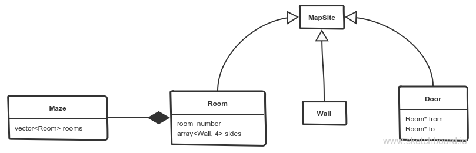

# Use case: Maze construction

To construct a maze, some components are needed. These components (rooms, doors, and walls) are implementations of a more general structure called *MapSite* since it might be the case that there share similar behaviors (e.g. `getPosition`).

Once these components are defined, a *Maze* (which is the final *product*) is composed by several rooms; and rooms have walls and doors. A door is just a connection between two rooms. Refer to the following image to see the class hierarchy.

